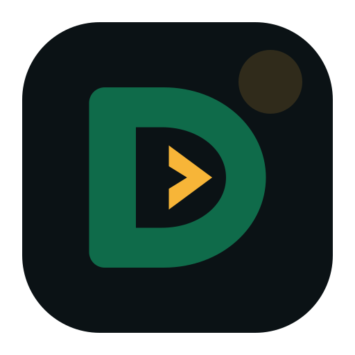

<div align="center">
    
    <h1>Doria Language Server</h1>
    <p>Official editor tooling for the <a href="https://github.com/dorialang/doria">Doria programming language</a>.</p>
</div>

This repository is the home of `doria-lsp`, syntax highlighting, and IDE integrations for writing Doria programs. It keeps editor-specific presentation separate from the compiler while reusing `doriac` as the authority for parsing, type checking, and diagnostics.

## Repository status

This repository owns the standalone `doria-lsp` binary, editor clients, shared syntax fixtures, and their release artifacts. The server consumes a commit-pinned `doriac` library dependency; it does not duplicate the compiler's lexer, parser, semantic checker, or diagnostics.

Compiler diagnostics remain structured through the editor boundary: the primary
label becomes the editor range, secondary labels become related locations,
severity and stable codes are preserved, and only fixes the compiler marks
Machine Applicable are offered as automatic quick fixes. This keeps the CLI,
editors, and Playground aligned on one diagnostic meaning.

Current editor support includes:

- VS Code language registration, TextMate highlighting, editor configuration,
  diagnostics, completion, hover, signature help, fixits through `doria-lsp`,
  and Run and Debug launch profiles that use Baton for projects.
- IntelliJ Platform support for RustRover, IntelliJ IDEA, PhpStorm, and compatible JetBrains IDEs, with local syntax highlighting and optional LSP integration.
- Shared accepted and rejected-syntax fixtures used to keep both highlighters aligned.

Stage 30 is complete. The editors recognize
`fn` arrow closures, anonymous `function` closures, explicit `with` capture
clauses, readonly/writable/once structural function types, parameter ownership,
checked effects, grouped nested types, and callable-value invocation. The language
server publishes the pinned compiler's semantic diagnostics and safe capture
fixes, and its hovers show compiler-resolved function signatures, inferred closure
facts, ownership, capture acquisition, consumption, and escape contracts. Analysis
also preserves exact structural function identity when a `mixed` or
nullable value is narrowed, including parameter ownership, invocation mode,
checked effects, and nullability; it does not reduce those values to a generic
callable label. Ordinary language-server analysis publishes no `E0641` for valid closures because the
pinned compiler has completed every accepted route; the server does not suppress
that historical, reserved diagnostic. Closure
programs execute through the compiler's debug and native targets and, for the
supported compatibility surface, the PHP backend. PHP remains a secondary
compatibility backend and its unrelated limitations remain in force. Completion
offers `map`, `filter`, and `reduce` only for resolved `List<T>` receivers, while
semantic hover presents the compiler's concrete callback, result, access, and
checked-effect facts. Diagnostics remain compiler-owned. Other collection
algorithms are not included. Stage 31 is complete. Stage 32 is complete. The server now
uses compiler-owned typed attribute schemas and applications for scoped
completion, named-argument completion, evaluated metadata hover, semantic
tokens, navigation, references, and conservative rename. `#[Test]` records
metadata but does not run tests; `#[PHPExport]` records metadata but does not
activate a bridge. Attributes remain compile-time metadata with no runtime
reflection. Stage 33 and Phase F are complete. All three Native Testing Foundation
slices are complete. In development sources, behavioral `describe`, `it`, and `test` declarations are
recognized by the compiler. The server consumes the compiler's typed test facts
and Baton/compiler source-scope context to publish declaration and description
semantic tokens, type-directed Test import and matcher completion, detailed
testing hovers, nested document symbols, package-qualified workspace symbols,
and authored navigation. It also projects exact compiler-owned `expect`, `fail`,
`AssertionError`, `not`, collection/Error matcher, diagnostic, and automatic
assertion-effect facts. It does not parse testing syntax, recreate matcher
semantics, infer test scope from file paths, invent Test definitions, or expose
generated callables. Stage 34 single class inheritance is complete. The server
projects compiler-owned class hierarchy, virtual-family, direct-parent, and
inherited-member facts into open-parent, override, and `parent::` completion;
hierarchy-aware hover and navigation; conservative virtual-family references and
rename; and semantic tokens. It does not parse or validate inheritance itself,
and it refuses rename whenever the complete family would cross an incomplete,
generated, dependency-cache, or otherwise readonly graph boundary. Stage 35 interfaces and traits are next. Ordinary
analysis remains target-neutral, and highlighting remains presentation only.

Project-aware tooling asks Baton asynchronously for its strict schema-1 project
document and gives each package-rooted dependency closure from the supplied
tooling plan to its own reusable compiler session. This preserves workspace
member isolation without flattening Baton's complete inventory. Unsaved editor
text overlays the matching supplied source; unopened
workspace, path-dependency, and generated sources remain indexed for diagnostics
and navigation. Generated and Git-cache sources are readable but never rename or
fix targets. Manifest, lock, source-inventory, and generated-output changes trigger
a debounced refresh. When Baton is unavailable or rejects discovery, open documents
continue in the compiler-owned partial-graph mode with one bounded status message.
The server never parses `Baton.toml` or `Baton.lock` and never invokes Baton per
hover, completion, or other interactive request.

The compiler also accepts constructor-rooted mutation through definitely initialized
writable property paths, owned initialization of instance properties, and replacement
of initialized writable owned properties. `doria-lsp` publishes the pinned compiler's
precise readonly-path, definite-initialization, ownership, and overlap diagnostics;
it does not reproduce those analyses. Moving values out of properties remains a
separate unsupported operation.

Checked-effect diagnostics also remain compiler-owned. Ordinary reusable
callables declare escaping nonambient checked effects explicitly, while the
selected entrypoint may omit `throws` and infer the checked effects that escape
it. The exact canonical `Doria\Std\Io\IoError` and
`Doria\Std\Io\InvalidUtf8Error` identities are ambient: they retain checked
runtime transport without requiring source `throws`. Hovers present ambient I/O
separately from required effects. Source finalizers may propagate checked Errors
to an outer context, and `E0632` is historical and reserved. The language server
neither infers effects nor suppresses diagnostics; it publishes the result and
structured effect facts from the pinned compiler.

## Layout

```text
editors/
  fixtures/          Shared highlighting fixtures
  intellij/doria/    JetBrains plugin
  vscode/doria/      VS Code extension
res/images/          Canonical Doria artwork
scripts/             Repository guardrails
server/              Standalone language-server crate and tests
docs/                Architecture and release documentation
```

## Build and package artifacts

Use one command from the repository root instead of remembering each ecosystem's build invocation:

```bash
php scripts/build.php help
php scripts/build.php <target>
```

| Target | Result |
| --- | --- |
| `server` | Debug `doria-lsp` executable |
| `server-release` | Optimized `doria-lsp` executable |
| `install-server` | Install `doria-lsp` into Cargo's global bin directory |
| `vscode` | Platform-specific `dist/doria-language-support.vsix` with bundled `doria-lsp` |
| `intellij` | Installable JetBrains ZIP with a compiler-matched `doria-lsp` under `editors/intellij/doria/build/distributions/` |
| `editors` | Both editor packages |
| `all` | Debug server and both editor packages |

Every target prints the absolute path of each artifact it creates. PHP and Rust/Cargo are needed for the server and VS Code targets; the VS Code target additionally needs Node.js/npm, and the IntelliJ target needs Java 21.

## Build the language server step by step

1. Open a terminal at the repository root—the directory containing the top-level `Cargo.toml`.
2. Build the debug server:

   ```bash
   php scripts/build.php server
   ```

   The underlying Cargo command is `cargo build --locked --bin doria-lsp`.

3. Find the executable at:

   ```text
   Linux/macOS: target/debug/doria-lsp
   Windows:     target\debug\doria-lsp.exe
   ```

   `target/` is at the repository root, not inside `server/`. If `CARGO_TARGET_DIR` is configured, the wrapper reports the actual absolute output path.

4. Verify the local executable:

   ```bash
   ./target/debug/doria-lsp --version
   ```

   On Windows PowerShell:

   ```powershell
   .\target\debug\doria-lsp.exe --version
   ```

5. To make the server globally available, install it through Cargo:

   ```bash
   php scripts/build.php install-server
   doria-lsp --version
   ```

   Cargo normally installs it as `$HOME/.cargo/bin/doria-lsp` on Linux/macOS or `%USERPROFILE%\.cargo\bin\doria-lsp.exe` on Windows. Rustup normally adds that directory to `PATH`. If it did not, add the relevant directory to your shell or system `PATH`:

   ```bash
   export PATH="$HOME/.cargo/bin:$PATH"
   doria-lsp --version
   ```

   Add that `export` line to your shell startup file to keep it across terminals. On Windows, add `%USERPROFILE%\.cargo\bin` through **System Properties → Environment Variables → Path**. Restart the IDE after changing `PATH`.

For local compiler or language-server development, an explicit override remains
available. In VS Code this is the `doria.languageServer.path` setting; in
JetBrains IDEs use **Settings → Languages & Frameworks → Doria → Language server
path**, or set `DORIA_LSP_PATH`. Released packages need none of these settings.

CI builds and tests the server on Linux, macOS, and Windows. GitHub release workflows build native archives and matching platform-specific VSIX packages for all three operating systems on x64 and arm64. The IntelliJ Platform plugin carries those six server binaries in one universal ZIP and selects the current host at runtime.

Both editor clients resolve the server in this order:

1. The editor's explicit Doria language-server setting (development override).
2. `DORIA_LSP_PATH` (development override).
3. The platform-matched `doria-lsp` bundled with the editor package.
4. Cargo's installed bin directory.
5. `doria-lsp` on `PATH`.

Normal installations therefore require no compiler selection, Cargo installation,
PATH setup, or language-server configuration. Repository-local `target/debug`
binaries are used only when selected explicitly. This prevents an old or
partially rebuilt workspace artifact from silently becoming the IDE's language
server.

## Development

Run the cross-editor consistency checks from this repository root:

```bash
php scripts/check_editor_highlighting.php
cargo fmt --all -- --check
cargo clippy --workspace --all-targets --locked -- -D warnings
cargo test --workspace --locked
npm --prefix editors/vscode/doria ci --ignore-scripts
npm --prefix editors/vscode/doria run check
```

Build the IntelliJ plugin with its checked-in Gradle wrapper:

```bash
cd editors/intellij/doria
./gradlew test buildPlugin
```

The packaged plugin is the single `doria-intellij-plugin-<version>.zip` written
to `editors/intellij/doria/build/distributions/`. JARs under `build/libs/` are
Gradle intermediates and are not installed through the IDE. A local build bundles
the current host's server; the release workflow assembles all six supported hosts
into the universal Marketplace artifact.

See [CONTRIBUTING.md](CONTRIBUTING.md) for the development workflow, [docs/architecture.md](docs/architecture.md) for component boundaries, and [docs/releasing.md](docs/releasing.md) for CalVer release coordination.

Semantic hover uses compiler-resolved symbols for classes, enums and enum
cases, free functions, constants, instance methods, and static methods. It displays signatures
and attached PHPDoc consistently in VS Code and JetBrains IDEs. Signature help uses
the same callable records and includes source-ordered checked-error effects. See
[docs/semantic-hover.md](docs/semantic-hover.md) for the behavior contract and
the bounded open-document namespace behavior and its deliberate limits.

When developing compiler syntax or semantics on a local Doria branch, build the
server against that checkout so editor diagnostics use the same compiler:

```bash
php scripts/build.php server --compiler-path ../doria
```

Use `all` instead of `server` to package both editor clients in the same command.
The local compiler mode creates a disposable runner under `target/`, writes the
resulting executable under this repository's `target/`, and does not change the
commit-pinned `Cargo.toml` or `Cargo.lock`. Each build reseeds the runner's private
lockfile from the repository lockfile before applying the local compiler override,
so dependency changes cannot leave later development-toolchain refreshes stuck on
stale generated state. Install a compiler-matched server with:

```bash
php scripts/build.php install-server --compiler-path ../doria
```

Editor clients prefer explicit settings or environment overrides, then bundled
or Cargo-installed release artifacts. They do not silently execute mutable
workspace `target/debug` binaries. Restart the language server or IDE after
replacing a running executable.

## Versioning

Language-server and editor releases track the Doria toolchain CalVer. The current target is `2026.03.1-canary`. Ecosystems that require SemVer-compatible numeric components encode the same release without zero padding, for example `2026.3.1-canary` in the VS Code manifest.

## License

MIT. See [LICENSE](LICENSE).
